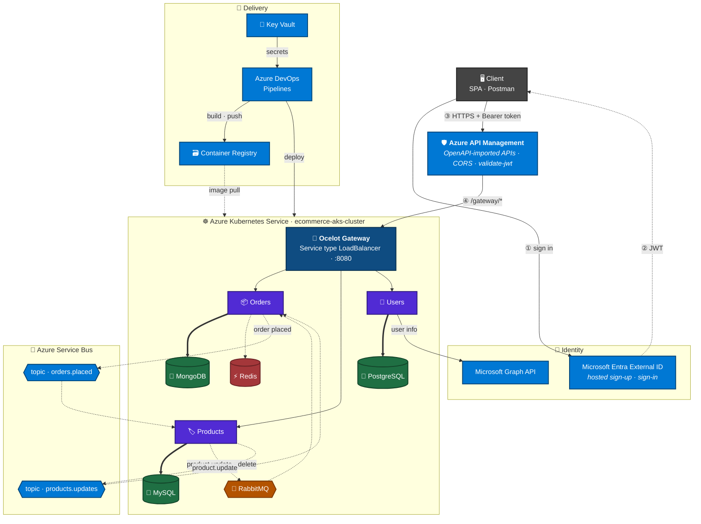
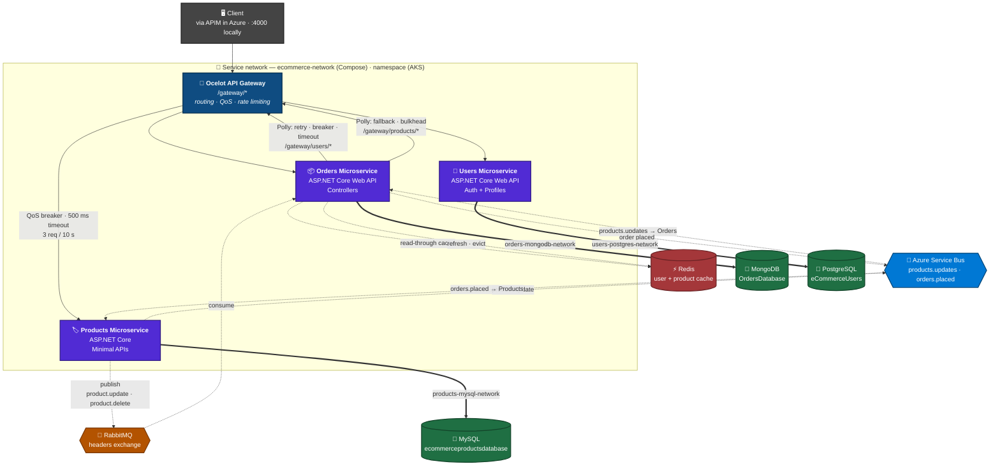
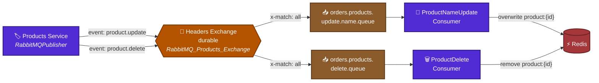
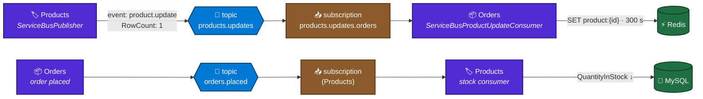
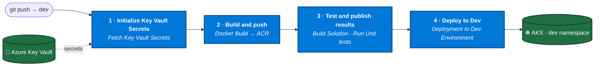
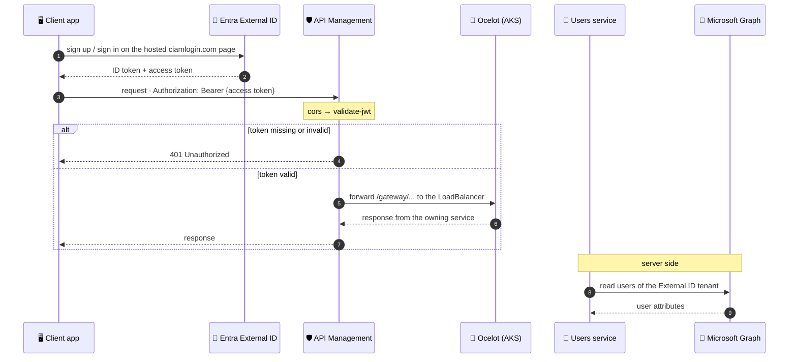
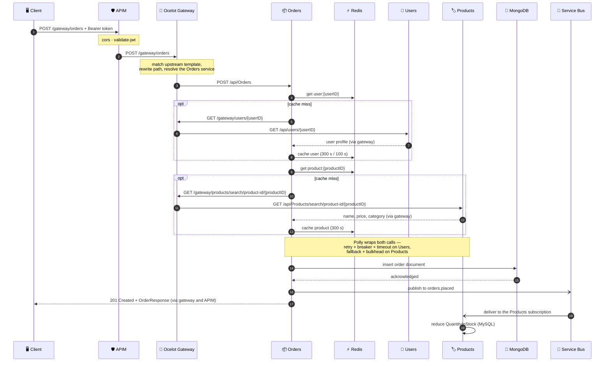
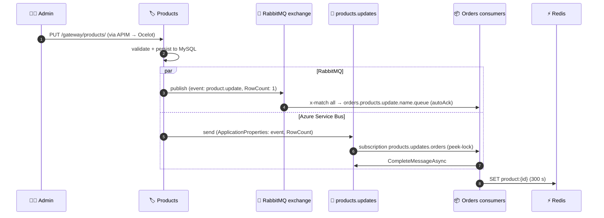
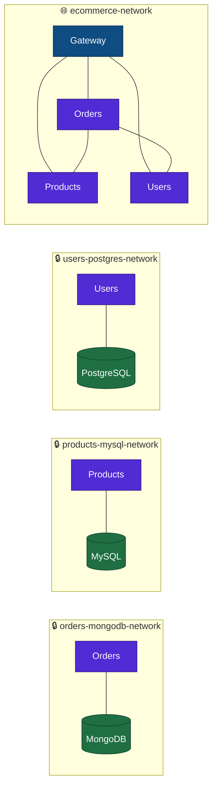

<div align="center">

# 🛒 eCommerce Microservices Application

**A production-style eCommerce backend in C# / .NET 8 — three independently deployable microservices, each owning its own database, behind an Ocelot API gateway. Built and run locally with Docker Compose, then taken all the way to Azure: AKS, Azure DevOps CI/CD, API Management, Microsoft Entra External ID and Azure Service Bus.**


**[Architecture](#-architecture) · [Project Snapshots](#-project-snapshots) · [Getting Started](#-getting-started) · [API Reference](#-api-reference)**

</div>

---

## 📂 Repositories

| Component | Repository |
|---|---|
| 🚪 API Gateway | [eCommerceSolution.ApiGateway](https://github.com/sayanpr8175/eCommerceSolution.ApiGateway) |
| 🏷️ Products | [eCommerceSolution.ProductsService](https://github.com/sayanpr8175/eCommerceSolution.ProductsService) |
| 👤 Users | [eCommerceSolution.UsersService](https://github.com/sayanpr8175/eCommerceSolution.UsersService) |
| 📦 Orders | [eCommerceSolution.OrdersService](https://github.com/sayanpr8175/eCommerceSolution.OrdersService) |
| 📸 Docker, AKS & Azure assets + snapshots | [ecommerce_microservice_proj_docker_aks_azure_related_files](https://github.com/sayanpr8175/ecommerce_microservice_proj_docker_aks_azure_related_files) |

---

## 📑 Table of Contents

1. [Overview](#-overview)
2. [Project Journey](#-project-journey)
3. [Architecture](#-architecture)
4. [Tech Stack](#-tech-stack)
5. [The Services](#-the-services)
6. [API Gateway (Ocelot)](#-api-gateway-ocelot)
7. [Resilience & Caching](#-resilience--caching)
8. [Event-Driven Messaging](#-event-driven-messaging)
9. [Kubernetes on AKS](#-kubernetes-on-aks)
10. [CI/CD with Azure DevOps](#-cicd-with-azure-devops)
11. [API Management & Identity](#-api-management--identity)
12. [How a Request Flows](#-how-a-request-flows)
13. [API Reference](#-api-reference)
14. [Getting Started](#-getting-started)
15. [Configuration](#-configuration)
16. [Networking](#-networking)
17. [Milestones](#-milestones)
18. [Project Snapshots](#-project-snapshots)

---

## 🎯 Overview

The backend is split into three services — **Products**, **Users** and **Orders** — that deploy independently, own their data (database-per-service) and talk to each other only over the network, never through a shared database. The same code runs two ways:

- **Locally** as a Docker Compose stack, with a private network per database.
- **On Azure** as Kubernetes workloads on AKS, shipped by Azure DevOps pipelines, fronted by Azure API Management and secured with Microsoft Entra External ID.

| | |
|---|---|
| 🧩 **3 microservices** | Products, Users, Orders — ASP.NET Core 8, layered API → Business Logic → Data Access |
| 🗄️ **3 databases** | MySQL, PostgreSQL, MongoDB — one per service, never shared |
| 🚪 **Two gateway tiers** | Azure API Management at the internet edge, Ocelot inside the cluster (`/gateway/*`) |
| 🔐 **Identity** | Entra External ID sign-up / sign-in · JWT validated in APIM · Microsoft Graph in the Users service |
| 🛡️ **Fault tolerance** | Polly policies inside Orders, plus Ocelot QoS at the gateway |
| 🚦 **Rate limiting** | Enforced by Ocelot on the Products collection route |
| ⚡ **Distributed caching** | Redis read-through cache for cross-service lookups, kept fresh by events |
| 📨 **Messaging** | RabbitMQ headers exchange + Azure Service Bus topics, in both directions between Products and Orders |
| ☸️ **Kubernetes** | AKS with nine Deployments per namespace, images served from Azure Container Registry |
| 🔁 **CI/CD** | One Azure DevOps pipeline per service — build & push to ACR, unit tests, deploy to AKS — with Key Vault-backed secrets |
| 🧪 **Tests** | xUnit · Moq · AutoFixture · FluentAssertions, run by the pipelines |

---

## 🧭 Project Journey

Built incrementally over about two and a half months. Every phase is backed by screenshots in [Project Snapshots](#-project-snapshots).

| Phase | Focus | What was delivered | Snapshots |
|:---:|---|---|:---:|
| 1 | 🐳 Local foundation | Three services, database-per-service, Docker Compose with isolated bridge networks, seed scripts | 01 – 03 |
| 2 | 🚪 Gateway & resilience | Ocelot gateway (13 routes), QoS, rate limiting, Polly policies, Redis read-through cache | 04 |
| 3 | 🐇 Messaging | RabbitMQ — direct → topic → **headers** exchange — and event-driven cache invalidation | 05 – 06 |
| 4 | ☸️ Kubernetes | AKS cluster, images in ACR, Deployments + Services for every component, LoadBalancer gateway | 07 – 14 |
| 5 | 🔁 CI/CD | Azure DevOps pipeline per service, Key Vault secrets, unit tests, automated deploy to `dev` | 15 – 23 |
| 6 | 🛡️ API Management | APIs imported from OpenAPI, backend wired to Ocelot, `cors` + `validate-jwt` inbound policies | 24 – 26 |
| 7 | 🔐 Identity | Entra External ID tenant, SPA app registration, hosted sign-up, Microsoft Graph | 27 – 28 |
| 8 | 📨 Cloud messaging | Service Bus topics `products.updates` and `orders.placed`; dead-letter queue and filters explored | 29 – 31 |

---

## 📐 Architecture

### Cloud deployment (Azure)



> **Reading it:** the client signs in through Entra External ID and calls API Management with the token. APIM applies CORS, validates the JWT and forwards to the Ocelot gateway — the only workload in the cluster with a public address. Everything behind it, databases, Redis and RabbitMQ included, runs as in-cluster Deployments behind ClusterIP Services. Azure Service Bus carries the two cross-service events, and Azure DevOps builds images into ACR, resolves secrets from Key Vault and rolls the workloads out.

### Service interactions



> **Reading the diagram:** solid arrows are synchronous HTTP. Orders calls *back through the gateway* rather than hitting Users and Products directly, so there is one routing layer for everyone, and each of those calls carries its own Polly policy set — see [Resilience & Caching](#-resilience--caching). Dashed arrows are asynchronous or out-of-band: the Redis lookup that runs *before* either HTTP call, and the events that keep the product cache and the stock level current — see [Event-Driven Messaging](#-event-driven-messaging). Thick arrows are database connections; locally each one lives on a private bridge network, so the Orders service physically cannot reach the Products database.

---

## 🧰 Tech Stack

| Area | Technologies |
|---|---|
| **Language & runtime** |   |
| **API styles** |    |
| **API gateway** |   — routing, QoS, rate limiting |
| **API management** |  — OpenAPI import, CORS and JWT-validation policies |
| **Databases** |    |
| **Validation & mapping** |   |
| **Resilience** |  — wait & retry, circuit breaker, timeout, fallback, bulkhead isolation |
| **Caching** |    |
| **Messaging** |  headers exchange, durable queues ·  topics & subscriptions via `Azure.Messaging.ServiceBus` |
| **Testing** |     |
| **Containers** |   |
| **Orchestration** |    |
| **CI/CD & secrets** |    |
| **Identity** |   |

---

## 🧩 The Services

| Service | Responsibility | Database | API style | Container port | Local URL | AKS Service |
|---|---|---|---|---|---|---|
| 🚪 **API Gateway** | Routing, QoS, rate limiting | — | Ocelot config | `8080` | `http://localhost:4000` | `apigateway` (LoadBalancer) |
| 🏷️ **Products** | Catalogue CRUD and search · publishes product events · reduces stock on `orders.placed` | MySQL | Minimal APIs | `8080` | `http://localhost:6001` | `products-microservice` |
| 👤 **Users** | Registration, login, user lookup · Entra External ID + Microsoft Graph | PostgreSQL | Controllers | `9090` | `http://localhost:5000` | `users-microservice` |
| 📦 **Orders** | Order lifecycle and cross-service composition · publishes `orders.placed` · keeps the product cache fresh | MongoDB | Controllers | `8080` | `http://localhost:7000` | `orders-microservice` |

**Orders is the hub.** When an order comes in, it calls Users to confirm who is buying and Products to confirm what is being bought, persists the composed order document in MongoDB, and announces the order on Azure Service Bus.

**Products owns inventory.** It listens on the `orders.placed` topic and reduces `QuantityInStock` for what was sold, so stock stays correct without Orders ever touching the Products database.

**The gateway is the front door.** Locally, clients use `http://localhost:4000/gateway/...`; in Azure they use the API Management hostname, which forwards to the same Ocelot routes. The direct service URLs stay published for local debugging only.

---

## 🚪 API Gateway (Ocelot)

A single ASP.NET Core host running [Ocelot](https://github.com/ThreeMammals/Ocelot) 23.4.3 with the Polly provider. There is no business logic in the gateway — it is configuration plus four lines of wiring:

```csharp
var builder = WebApplication.CreateBuilder(args);

builder.Configuration.AddJsonFile("ocelot.json", optional: false, reloadOnChange: true);
builder.Services.AddOcelot().AddPolly();

var app = builder.Build();
await app.UseOcelot();
app.Run();
```

`reloadOnChange: true` means route changes in `ocelot.json` are picked up without restarting the container.

### Route table

Every upstream path is namespaced under `/gateway/` and, as configured, ends with a trailing slash. Downstream hosts are resolved by name — Docker DNS on `ecommerce-network` locally, Kubernetes Service DNS on AKS.

<details open>
<summary><b>📦 Orders routes</b> → <code>ordersmicroservice.api:8080</code></summary>

| Methods | Upstream (gateway) | Downstream (service) |
|---|---|---|
| `GET` `POST` `OPTIONS` | `/gateway/Orders/` | `/api/Orders` |
| `GET` | `/gateway/Orders/search/orderid/{orderID}/` | `/api/Orders/search/orderid/{orderID}` |
| `GET` | `/gateway/Orders/search/productid/{productID}/` | `/api/Orders/search/productid/{productID}` |
| `GET` | `/gateway/Orders/search/userid/{userID}/` | `/api/Orders/search/userid/{userID}` |
| `GET` | `/gateway/Orders/search/orderDate/{orderDate}/` | `/api/Orders/search/orderDate/{orderDate}` |
| `PUT` `DELETE` `OPTIONS` | `/gateway/Orders/{orderID}/` | `/api/Orders/{orderID}` |

</details>

<details open>
<summary><b>🏷️ Products routes</b> → <code>products-microservice:8080</code></summary>

| Methods | Upstream (gateway) | Downstream (service) |
|---|---|---|
| `GET` `POST` `PUT` `OPTIONS` | `/gateway/Products/` | `/api/Products` |
| `GET` | `/gateway/Products/search/product-id/{productID}/` | `/api/Products/search/product-id/{productID}` |
| `GET` | `/gateway/Products/search/{searchString}/` | `/api/Products/search/{searchString}` |
| `DELETE` `OPTIONS` | `/gateway/Products/{productID}/` | `/api/Products/{productID}` |

</details>

<details open>
<summary><b>👤 Users routes</b> → <code>users-microservice:9090</code></summary>

| Methods | Upstream (gateway) | Downstream (service) |
|---|---|---|
| `POST` `OPTIONS` | `/gateway/Users/Auth/register/` | `/api/Auth/register` |
| `POST` `OPTIONS` | `/gateway/Users/Auth/login/` | `/api/Auth/login` |
| `GET` | `/gateway/Users/{userID}/` | `/api/users/{userID}` |

</details>

`OPTIONS` is declared on every mutating route so browser CORS preflight requests reach the downstream service instead of being rejected at the edge.

### Edge policies

Cross-cutting concerns are applied per route rather than globally, so a noisy endpoint can be protected without penalising the rest of the API. Today they sit on the Products collection route — the busiest read path.

| Route | Policy | Settings | Effect |
|---|---|---|---|
| `/gateway/Products/` | **QoS** *(Polly-backed)* | `ExceptionsAllowedBeforeBreaking: 3` · `DurationOfBreak: 1000` ms · `TimeoutValue: 500` ms | Circuit opens after 3 consecutive failures and stays open 1 s; any request slower than 500 ms is cut off |
| `/gateway/Products/` | **Rate limiting** | `Limit: 3` per `Period: 10s` · `PeriodTimespan: 5` · `HttpStatusCode: 429` | A 4th request inside a 10-second window gets `429 Too Many Requests`; the client should back off 5 s |

QoS is supplied by `Ocelot.Provider.Polly` — the `.AddPolly()` call in `Program.cs` is what activates it. Ocelot's QoS `DurationOfBreak` and `TimeoutValue` are in **milliseconds**, unlike the in-service Polly policies below, which are configured in seconds.

These limits still apply behind API Management: responses that come through APIM carry Ocelot's `X-Rate-Limit-*` headers (snapshot 26).

### Two layers of resilience

The gateway and the Orders service both use Polly, but they guard different hops and are deliberately independent:

| | Gateway (Ocelot QoS) | Orders service (in-process Polly) |
|---|---|---|
| **Protects** | Client → downstream service | Orders → gateway → Users / Products |
| **Scope** | Per route, declarative in `ocelot.json` | Per HTTP client, composed in C# |
| **Fails as** | `503` / `429` from the edge | Placeholder DTO, order still completes |

A client hitting `/gateway/Products/` gets edge protection. An order placed through `/gateway/Orders/` gets edge routing *and* the internal Polly stack on the two calls Orders makes on its behalf.

---

## 🦺 Resilience & Caching

Every outbound call from Orders is wrapped in Polly, and both cross-service lookups sit behind a Redis read-through cache. The two dependencies are deliberately protected in different ways.

### Policy matrix

| Outbound call | Policies | Configuration |
|---|---|---|
| **Orders → Users** | Retry → Circuit Breaker → Timeout | 5 retries, exponential backoff `2^n` seconds · breaker opens after 3 consecutive failures and stays open 2 minutes · 5 s timeout |
| **Orders → Products** | Fallback + Bulkhead Isolation | 2 concurrent requests, queue of 40 · fallback returns `503` carrying placeholder product JSON |

`UsersMicroservicePolicies.GetCombinedPolicy()` composes the first three with `Policy.WrapAsync(retry, circuitBreaker, timeout)`. Retry is outermost, so every attempt passes through the breaker and is individually bounded by the timeout — and a timeout counts as a failure the breaker can trip on.

Policies live behind interfaces so they can be reused and tested independently:

| Interface | Members |
|---|---|
| `IPollyPolicies` | `GetRetryPolicy(retryCount)`, `GetCircuitBreakerPolicy(handledEventsAllowedBeforeBreaking, durationOfBreak)`, `GetTimeoutPolicy(timeout)` |
| `IUsersMicroservicePolicies` | `GetCombinedPolicy()` |
| `IProductsMicroservicePolicies` | `GetFallBackPolicy()`, `GetBulkHeadIsolationPolicy()` |

### Degraded responses

An unhealthy dependency never takes the request down. Each failure mode is caught and answered with a placeholder DTO, so the order still completes:

| Condition | Caught as | What the caller sees |
|---|---|---|
| Breaker open (Users) | `BrokenCircuitException` | User fields read `Temporarily unavailable (Circuit breaker)` |
| Timeout (Users) | `TimeoutRejectedException` | User fields read `Temporarily unavailable (Timeout)` |
| Bulkhead queue full (Products) | `BulkheadRejectedException` | Product fields read `Services Unavailable (Bulkhead isolation blocked)` |
| Fallback fired | `503` from the fallback policy | Placeholder DTO deserialized from the fallback payload |
| Dependency returns `404` | — | `null`, surfaced as a normal not-found |
| Dependency returns `400` | — | `HttpRequestException` — a genuine client error is *not* masked |

### Redis cache

Both clients check Redis before making an HTTP call and populate it on the way back. Redis is wired up in `AddBusinessLogicLayer` via `AddStackExchangeRedisCache`, pointed at `REDIS_HOST:REDIS_PORT`.

| Key pattern | Value | Absolute TTL | Sliding TTL | Written by |
|---|---|---|---|---|
| `user:{userID}` | serialized `UserDTO` | 300 s | 100 s | HTTP read-through only |
| `product:{productID}` | serialized `ProductDTO` | 300 s | — | HTTP read-through **and** `product.update` events (RabbitMQ and Service Bus) |

The product entry used to expire after 30 seconds, because Orders had no way to hear that a price or name had changed and a short window was the only defence. Events removed that constraint: `product.update` overwrites the key and `product.delete` removes it, so freshness now comes from invalidation rather than expiry, and the TTL could move out to 300 s.

Placeholder DTOs from any degraded path are returned but **never written to the cache**, so a brief outage cannot poison lookups for the rest of the TTL.

---

## 📨 Event-Driven Messaging

Products and Orders never call each other to announce that something changed — they publish events. Two brokers are wired in: **RabbitMQ**, which runs in-cluster and came first, and **Azure Service Bus**, the managed broker added for the cloud. They run side by side, so a product update reaches Orders through both.

| Event | Publisher | Transport | Consumer | Effect |
|---|---|---|---|---|
| `product.update` | Products | RabbitMQ headers exchange **and** Service Bus topic `products.updates` | Orders | Overwrites `product:{id}` in Redis |
| `product.delete` | Products | RabbitMQ headers exchange | Orders | Evicts `product:{id}` from Redis |
| order placed | Orders | Service Bus topic `orders.placed` | Products | Reduces `QuantityInStock` in MySQL |

### RabbitMQ — headers exchange

The project worked through direct and topic routing first; both are still visible as commented-out code next to the current calls. **Headers won** because routing is driven by typed key/value pairs instead of a dotted string, so a subscriber can match on several independent attributes without encoding them all into one routing key. Every publish uses `routingKey: string.Empty` — the headers *are* the routing.



**Publishers.** `RabbitMQPublisher` lives in the Products service and declares the exchange on every publish, so the topology is self-healing if the broker is reset.

| Trigger | Call | Headers | Payload |
|---|---|---|---|
| `ProductsService.UpdateProduct` | `Publish<Product>(headers, product)` | `event: product.update`, `RowCount: 1` | the full `Product` entity |
| `ProductsService.DeleteProduct` | `Publish<ProductDeleteMessage>(headers, message)` | `event: product.delete`, `RowCount: 1` | `ProductDeleteMessage(ProductID, ProductName)` |

Deletion publishes only when the repository confirms the row was actually removed. A second `Publish<T>(string routingKey, T message)` overload is kept from the direct-exchange approach the project started with; nothing calls it now.

**Bindings.**

| Queue | Binding arguments | `x-match` | Consumer |
|---|---|---|---|
| `orders.products.update.name.queue` | `event: product.update`, `RowCount: 1` | `all` | `RabbitMQProductNameUpdateConsumer` |
| `orders.products.delete.queue` | `event: product.delete`, `RowCount: 1` | `all` | `RabbitMQProductDeleteConsumer` |

`x-match: all` means every header in the binding must match before a message is delivered, so a `product.delete` message is never seen by the update queue. Both queues are declared `durable: true`, `exclusive: false`, `autoDelete: false` — they survive a broker restart and are not tied to one connection.

**Consumers.** Both implement `IDisposable` and are driven by an `IHostedService`, so they start with the application and tear down their channel and connection on shutdown. They are registered transient but resolved once by their hosted service, so a single instance lives for the lifetime of the process.

| Consumer | Deserializes to | Cache effect |
|---|---|---|
| `RabbitMQProductNameUpdateConsumer` | `ProductDTO` | `SetStringAsync("product:{id}", …)` with 300 s absolute expiry |
| `RabbitMQProductDeleteConsumer` | `ProductDeleteMessage` | `RemoveAsync("product:{id}")` |

Both consume with `autoAck: true`: the broker considers a message delivered the moment it hands it over, which keeps the consumer simple at the cost of losing a message if the handler throws. The Service Bus path below closes that gap.

### Azure Service Bus — topics & subscriptions

Service Bus maps cleanly onto the RabbitMQ design: a **topic** plays the exchange, a **subscription** plays the bound queue, and the same `event` / `RowCount` headers travel as message `ApplicationProperties` — exactly what subscription rules filter on. Everything lives in the `ecommerce-sayan-servicebus-namespace` namespace.



| Entity | Kind | Direction | Notes |
|---|---|---|---|
| `products.updates` | Topic | Products → Orders | 1 GB max size · 14-day default message TTL |
| `products.updates.orders` | Subscription | read by Orders | Peek-lock, completed explicitly after the cache write |
| `orders.placed` | Topic | Orders → Products | 1 GB max size · 14-day default message TTL |

**Publisher (Products).** The publisher reuses the RabbitMQ header contract, so both brokers see the same metadata:

```csharp
public ServiceBusPublisher(ServiceBusClient serviceBusClient, IConfiguration configuration)
{
    _sender = serviceBusClient.CreateSender(configuration["ServiceBus:ServiceBus_ProductsTopic"]);
}

public async Task Publish<T>(Dictionary<string, object> headers, T message)
{
    var serviceBusMessage = new ServiceBusMessage(JsonSerializer.Serialize(message));

    // Same header contract as RabbitMQ (event, RowCount), carried as application properties
    foreach (var header in headers)
        serviceBusMessage.ApplicationProperties[header.Key] = header.Value;

    await _sender.SendMessageAsync(serviceBusMessage);
}
```

**Consumer (Orders).** `ServiceBusProductUpdateConsumer`, condensed:

```csharp
_serviceBusProcessor = serviceBusClient.CreateProcessor(
    configuration["ServiceBus:ServiceBus_ProductsTopic"],               // products.updates
    configuration["ServiceBus:ServiceBus_ProductsTopic_Subscription"],  // products.updates.orders
    new ServiceBusProcessorOptions { AutoCompleteMessages = false });

_serviceBusProcessor.ProcessMessageAsync += async args =>
{
    ProductDTO? product = JsonSerializer.Deserialize<ProductDTO>(args.Message.Body.ToString());

    if (product is not null)
        await HandleProductUpdation(product);          // SetStringAsync("product:{id}", json, 300 s absolute)

    await args.CompleteMessageAsync(args.Message);     // settle only after the cache write
};
```

`ServiceBusProductNameUpdateHostedService` starts the processor (`StartProcessingAsync`) when the application starts and disposes it on shutdown — the same hosted-service pattern as the RabbitMQ consumers.

**Delivery guarantees.** The processor runs in peek-lock mode with auto-completion off, and a message is completed only after Redis has been written. If the handler throws, the message is never completed: Service Bus makes it available again and, once it exceeds the subscription's maximum delivery count, moves it to the subscription's dead-letter sub-queue. Nothing is silently lost, which is the guarantee the RabbitMQ consumers' `autoAck: true` cannot give.

**Explored along the way**

- **Dead-letter queue** — read through Service Bus Explorer's *Dead-letter* tab, or by opening a receiver on the `$deadletterqueue` sub-queue:

  ```csharp
  await using var receiver = serviceBusClient.CreateReceiver(
      "products.updates", "products.updates.orders",
      new ServiceBusReceiverOptions { SubQueue = SubQueue.DeadLetter });

  ServiceBusReceivedMessage? dead = await receiver.ReceiveMessageAsync(TimeSpan.FromSeconds(5));
  Console.WriteLine($"{dead?.DeadLetterReason}: {dead?.DeadLetterErrorDescription}");
  ```

- **Subscription filters** — SQL and correlation rules that match on application properties such as `event`, the Service Bus counterpart of RabbitMQ's binding arguments.

**Provisioning** with the Azure CLI:

```bash
RG=ecommerce-resource-group
NS=ecommerce-sayan-servicebus-namespace

# Products → Orders
az servicebus topic create --resource-group $RG --namespace-name $NS \
  --name products.updates --max-size 1024 --default-message-time-to-live P14D
az servicebus topic subscription create --resource-group $RG --namespace-name $NS \
  --topic-name products.updates --name products.updates.orders

# Orders → Products
az servicebus topic create --resource-group $RG --namespace-name $NS \
  --name orders.placed --max-size 1024 --default-message-time-to-live P14D
az servicebus topic subscription create --resource-group $RG --namespace-name $NS \
  --topic-name orders.placed --name <products-subscription>
```

### RabbitMQ vs Azure Service Bus

| Concern | RabbitMQ (in-cluster) | Azure Service Bus (managed) |
|---|---|---|
| Fan-out unit | Headers exchange | Topic |
| Per-consumer buffer | Durable queue | Subscription |
| Routing | Binding arguments with `x-match: all` | Subscription rules (SQL / correlation filters) |
| Metadata | AMQP headers `event`, `RowCount` | `ApplicationProperties` `event`, `RowCount` |
| Acknowledgement | `autoAck: true` | Peek-lock + explicit `CompleteMessageAsync` |
| Failed handler | Message lost | Redelivered, then dead-lettered |
| Operations | Self-hosted Deployment | Fully managed PaaS |
| Events carried | `product.update`, `product.delete` | `product.update`, order placed |

### What this buys

A price change in the Products service reaches the Orders cache in milliseconds instead of waiting out a TTL, a deleted product stops being served from cache immediately, and every order lowers stock without a synchronous call back into Products. The services share no code — only the header contract and the topic names.

---

## 🚢 Kubernetes on AKS

The whole stack runs on **`ecommerce-aks-cluster`** in `ecommerce-resource-group` (East US). Every component — the gateway, the three services, the three databases, Redis and RabbitMQ — is a Deployment fronted by a Service, and only the gateway is exposed outside the cluster.

| Namespace | Deployed by | Role |
|---|---|---|
| `ecommerce-namespace` | `kubectl apply` of the AKS manifests | First cloud rollout |
| `dev` | Azure DevOps pipelines (*Deploy to Dev*) | Continuous-deployment target |

| Component | Deployment | Service | Type | Port(s) |
|---|---|---|---|---|
| 🚪 Ocelot gateway | `apigateway-deployment` | `apigateway` | **LoadBalancer** | `8080` |
| 📦 Orders | `orders-microservice-deployment` | `orders-microservice` | ClusterIP | `8080` |
| 🏷️ Products | `products-microservice-deployment` | `products-microservice` | ClusterIP | `8080` |
| 👤 Users | `users-microservice-deployment` | `users-microservice` | ClusterIP | `9090` |
| 🍃 MongoDB | `mongodb-deployment` | `mongodb` | ClusterIP | `27017` |
| 🐬 MySQL | `mysql-deployment` | `mysql` | ClusterIP | `3306` |
| 🐘 PostgreSQL | `postgres-deployment` | `postgres` | ClusterIP | `5432` |
| ⚡ Redis | `redis-deployment` | `redis` | ClusterIP | `6379` |
| 🐇 RabbitMQ | `rabbitmq-deployment` | `rabbitmq` | ClusterIP | `5672` · `15672` |

**Images** come from Azure Container Registry **`sayanecommerceregistry`**, which holds seven repositories: `apigateway`, `orders-microservice`, `products-microservice`, `users-microservice`, and the three database images `ecommerce-mongodb`, `ecommerce-mysql` and `ecommerce-postgres`.

**Service discovery** works as it did in Compose, one level up: Kubernetes Service names resolve through cluster DNS, so components still address each other by name and never by IP.

---

## 🔁 CI/CD with Azure DevOps

Each service has its own pipeline in the **eCommerce** Azure DevOps project — *eCommerce Users Microservice*, *eCommerce Orders Microservice* and *eCommerce Products Microservice* — triggered by commits to the `dev` branch of its Azure Repos repository. Every pipeline builds the service image, runs its tests and deploys to AKS. The Products pipeline, shown below, also resolves its secrets from Azure Key Vault in a dedicated first stage.



| Stage | Job | What happens |
|---|---|---|
| Initialize Key Vault Secrets | Fetch Key Vault Secrets | Reads the secrets the pipeline needs from Azure Key Vault, so none of them live in YAML or in the repository |
| Build and push | Docker Build | Builds the service image and pushes it to `sayanecommerceregistry` |
| Test and publish results | Run Unit tests | Builds the solution, runs the unit tests and publishes the results to the run's *Tests* tab |
| Deploy to Dev | Deployment to Dev Environment | Rolls the new image out to the `dev` namespace through an Azure DevOps environment |

Shared values are kept in pipeline **variable groups** (Library); secrets are resolved from Key Vault at run time.

### Unit tests

The Products service ships **11 xUnit tests** for `ProductsService`, built with **Moq** (repository, mapper, validators and both message publishers), **AutoFixture** (test data) and **FluentAssertions**. Because the RabbitMQ and Service Bus publishers are mocked, the suite needs no broker and runs inside the pipeline. The Users and Orders pipelines run their own test projects.

| Operation | Covered behaviour |
|---|---|
| `AddProduct` | valid request returns the saved product · `null` request throws · invalid request throws one exception listing every validation error, and the repository is never called |
| `GetProducts` | returns all products |
| `GetProductByCondition` | a match returns the product · no match returns `null` |
| `UpdateProduct` | valid request returns the updated product · unknown ID throws `Invalid Product ID` · invalid request lists every validation error |
| `DeleteProduct` | existing product returns `true` · unknown product returns `false` and `DeleteProduct` is never called |

```csharp
[Fact]
public async Task UpdateProduct_ProductDoesNotExist_ThrowsArgumentException()
{
    // Arrange
    var request = _fixture.Create<ProductUpdateRequest>();
    SetupProductLookup(null);

    // Act
    Func<Task> act = () => _service.UpdateProduct(request);

    // Assert
    await act.Should().ThrowAsync<ArgumentException>().WithMessage("Invalid Product ID");
    _repositoryMock.Verify(repo => repo.UpdateProduct(It.IsAny<Product>()), Times.Never);
}
```

Run them locally with `dotnet test`.

---

## 🔐 API Management & Identity

### Azure API Management

In Azure, clients no longer call the Ocelot gateway directly. They call **API Management** (`sayan-ecommerce-api`), which forwards to the gateway's LoadBalancer address.

- **APIs imported from OpenAPI.** Each service's Swagger / OpenAPI document was imported as its own API — *eCommerce users API*, *Orders Microservice API* and *Products MicroService API* — so operations, parameters and schemas come straight from the code. Each API's backend URL points at the Ocelot gateway with the matching `/gateway/...` prefix.
- **Same paths, new host.** The public path shape mirrors Ocelot's, so moving a client from local to cloud only changes the host.
- **Inbound policies.** Inbound processing (shown for the Orders API) runs `base` → `cors` → `validate-jwt` before a request is forwarded. `cors` allows only the registered client application's origin, with an explicit list of methods and headers. `validate-jwt` checks the bearer token issued by Entra External ID against the tenant's OpenID configuration, and anything that fails is rejected with `401` before it reaches the cluster.

| Client calls (APIM) | APIM forwards to (Ocelot on AKS) | Ocelot routes to |
|---|---|---|
| `https://<apim>.azure-api.net/gateway/orders` | `http://<gateway-ip>:8080/gateway/orders` | Orders · `/api/Orders` |
| `https://<apim>.azure-api.net/gateway/products/` | `http://<gateway-ip>:8080/gateway/products/` | Products · `/api/Products` |
| `https://<apim>.azure-api.net/gateway/Users/Auth/login` | `http://<gateway-ip>:8080/gateway/Users/Auth/login` | Users · `/api/Auth/login` |

Simplified shape of the inbound policy, with identifiers replaced by placeholders:

```xml
<inbound>
    <base />
    <cors>
        <allowed-origins>
            <origin>https://localhost:4200</origin>  <!-- SPA registered in Entra -->
        </allowed-origins>
        <allowed-methods>
            <method>GET</method>
            <method>POST</method>
            <method>PUT</method>
            <method>DELETE</method>
        </allowed-methods>
        <allowed-headers>
            <header>Content-Type</header>
            <header>Authorization</header>
        </allowed-headers>
    </cors>
    <validate-jwt header-name="Authorization" failed-validation-httpcode="401">
        <openid-config url="https://{tenant-subdomain}.ciamlogin.com/{tenant-id}/v2.0/.well-known/openid-configuration" />
        <audiences>
            <audience>{api-client-id}</audience>
        </audiences>
    </validate-jwt>
</inbound>
```

### Microsoft Entra External ID

Customer identity lives in a dedicated **External ID tenant** (`sayanecommercedev.onmicrosoft.com`, branded *SAYAN-ECOMMERCE*), so sign-up, sign-in and credential storage can be handled by the platform.

- **App registration** — *eCommerce Client*, registered as a single-page application with its redirect and front-channel logout URIs.
- **Hosted sign-up** — users register on the tenant's `ciamlogin.com` page, which also collects profile attributes such as given name and surname.
- **Tokens** — the access token issued to the client is the one APIM's `validate-jwt` policy checks.
- **Microsoft Graph** — the Users service queries Graph to read the information of users registered in the tenant, so it can work with identities that live in Entra.



The Users service's original register / login endpoints remain available alongside the External ID flow — see [API Reference](#-api-reference).

---

## 🔄 How a Request Flows

### Placing an order

Placing an order touches API Management, the gateway, all three services, Redis, MongoDB and Service Bus. Locally, step 1 goes straight to Ocelot on `:4000`; everything after it is identical.



On a cache hit, Redis answers at the `get` step and the gateway round-trip is skipped entirely. Orders talks to the gateway rather than to Users and Products directly, so its outbound calls take the same routing path as a client's.

### Updating a product

Independently of any order, a product update fans out over both brokers and refreshes the Orders cache out of band, so the next order sees fresh data without waiting out the TTL:



Both consumers write the same key with the same data, so receiving the update twice is harmless — the write is idempotent. Snapshot 31 shows exactly this in the Orders logs.

---

## 📡 API Reference

Three ways in: through **API Management** in Azure (`https://<apim>.azure-api.net/gateway/...`), through the **Ocelot gateway** locally (`http://localhost:4000/gateway/...`), or directly against a service port while debugging one service in isolation. The gateway routes are listed in [API Gateway (Ocelot)](#-api-gateway-ocelot).

<details open>
<summary><b>🚪 API Gateway</b> — <code>http://localhost:4000</code> locally · APIM hostname in Azure</summary>

| Method | Endpoint | Routes to |
|---|---|---|
| `GET` `POST` | `/gateway/Orders/` | Orders — list all / place an order |
| `GET` | `/gateway/Orders/search/orderid/{orderID}/` | Orders — by ID |
| `GET` | `/gateway/Orders/search/productid/{productID}/` | Orders — containing a product |
| `GET` | `/gateway/Orders/search/userid/{userID}/` | Orders — placed by a user |
| `GET` | `/gateway/Orders/search/orderDate/{orderDate}/` | Orders — by date (`yyyy-MM-dd`) |
| `PUT` `DELETE` | `/gateway/Orders/{orderID}/` | Orders — update / delete |
| `GET` `POST` `PUT` | `/gateway/Products/` | Products — list / add / update *(rate limited, QoS)* |
| `GET` | `/gateway/Products/search/product-id/{productID}/` | Products — by GUID |
| `GET` | `/gateway/Products/search/{searchString}/` | Products — search name and category |
| `DELETE` | `/gateway/Products/{productID}/` | Products — delete |
| `POST` | `/gateway/Users/Auth/register/` | Users — register |
| `POST` | `/gateway/Users/Auth/login/` | Users — login |
| `GET` | `/gateway/Users/{userID}/` | Users — profile by GUID |

</details>

<details>
<summary><b>🏷️ Products Microservice</b> — <code>http://localhost:6001</code></summary>

| Method | Endpoint | Description |
|---|---|---|
| `GET` | `/api/products` | Get all products |
| `GET` | `/api/products/search/product-id/{productID}` | Get a single product by GUID |
| `GET` | `/api/products/search/{searchString}` | Search across product name **and** category |
| `POST` | `/api/products` | Add a product *(FluentValidation)* |
| `PUT` | `/api/products` | Update a product *(FluentValidation)* — publishes `product.update` |
| `DELETE` | `/api/products/{productID}` | Delete a product — publishes `product.delete` |

Validation failures return `400` with an RFC 7807 `ValidationProblem` payload grouped by property name.

</details>

<details>
<summary><b>👤 Users Microservice</b> — <code>http://localhost:5000</code></summary>

| Method | Endpoint | Description |
|---|---|---|
| `POST` | `/api/auth/register` | Register a new user → `AuthenticationResponse` |
| `POST` | `/api/auth/login` | Authenticate → `AuthenticationResponse` |
| `GET` | `/api/users/{userID}` | Fetch a user profile by GUID |

`/api/users/{userID}` is the endpoint the Orders service calls internally during checkout.

</details>

<details>
<summary><b>📦 Orders Microservice</b> — <code>http://localhost:7000</code></summary>

| Method | Endpoint | Description |
|---|---|---|
| `GET` | `/api/orders` | Get all orders |
| `GET` | `/api/orders/search/orderid/{orderID}` | Get an order by ID |
| `GET` | `/api/orders/search/productid/{productID}` | All orders containing a given product |
| `GET` | `/api/orders/search/userid/{userID}` | All orders placed by a given user |
| `GET` | `/api/orders/search/orderDate/{orderDate}` | All orders for a date (`yyyy-MM-dd`) |
| `POST` | `/api/orders` | Place a new order — publishes to `orders.placed` |
| `PUT` | `/api/orders/{orderID}` | Update an order |
| `DELETE` | `/api/orders/{orderID}` | Delete an order |

</details>

### Quick smoke tests

**Local**, through the gateway. Keep the trailing slash — the upstream templates are configured with one.

```bash
# List products
curl http://localhost:4000/gateway/Products/

# Register a user
curl -X POST http://localhost:4000/gateway/Users/Auth/register/ \
  -H "Content-Type: application/json" \
  -d '{"email":"demo@example.com","password":"P@ssw0rd!","personName":"Demo User","gender":"Male"}'

# List orders
curl http://localhost:4000/gateway/Orders/

# Trip the rate limiter — the 4th call inside 10 s returns 429
for i in 1 2 3 4; do
  curl -s -o /dev/null -w "%{http_code}\n" http://localhost:4000/gateway/Products/
done
```

**Azure**, through API Management:

```bash
APIM=https://<your-apim-name>.azure-api.net
TOKEN=<access token issued by Entra External ID>
# Add -H "Ocp-Apim-Subscription-Key: <key>" if the API requires a subscription

curl -H "Authorization: Bearer $TOKEN" "$APIM/gateway/orders"
curl -H "Authorization: Bearer $TOKEN" "$APIM/gateway/products/"
```

---

## 🚀 Getting Started

### Run locally with Docker Compose

| Requirement | Notes |
|---|---|
|  | With Docker Compose v2 |
|  | Only needed to run services outside containers |

**1. Clone the repositories side by side**

```bash
git clone https://github.com/sayanpr8175/eCommerceSolution.ApiGateway.git
git clone https://github.com/sayanpr8175/eCommerceSolution.ProductsService.git
git clone https://github.com/sayanpr8175/eCommerceSolution.UsersService.git
git clone https://github.com/sayanpr8175/eCommerceSolution.OrdersService.git
```

**2. Build the Products and Users images** — the Compose file references them as pre-built images:

```bash
docker build -t products-microservice:latest ./eCommerceSolution.ProductsService
docker build -t users-microservice:latest   ./eCommerceSolution.UsersService
```

**3. Bring the stack up** from the Orders solution, which holds `docker-compose.yml` alongside the `ApiGateway` and `OrdersMicroservice.API` projects:

```bash
cd eCommerceSolution.OrdersService
docker compose up -d --build
```

**4. Verify**

```bash
docker compose ps
curl http://localhost:4000/gateway/Products/
```

| Container | Host port | Purpose |
|---|---|---|
| `apigateway` | `4000` | Ocelot API Gateway — single entry point |
| `ordersmicroservice.api` | `7000` | Orders API |
| `products-microservice` | `6001` | Products API |
| `users-microservice` | `5000` | Users API |
| `mongodb-container` | `27017` | Orders data |
| `mysql-container` | `3307` | Products data |
| `postgres-container` | `5433` | Users data |

Redis (`redis-container`) and RabbitMQ (`rabbitmq-container`) run in the same stack; the RabbitMQ management UI is at `http://localhost:15672`. Seed scripts in `./mongodb-scripts`, `./mysql-scripts` and `./postgres-scripts` are mounted into each database's `docker-entrypoint-initdb.d` and run automatically on first start. See `docker-compose.yml` in the Orders repository for the full service definitions.

### Deploy to Azure Kubernetes Service

| Requirement | Notes |
|---|---|
| Azure CLI | Signed in to the subscription that holds `ecommerce-resource-group` |
| kubectl | `az aks install-cli` installs it |

```bash
# 1. Push an image to Azure Container Registry (repeat for each service and database image)
az acr login --name sayanecommerceregistry
docker tag products-microservice:latest sayanecommerceregistry.azurecr.io/products-microservice:latest
docker push sayanecommerceregistry.azurecr.io/products-microservice:latest

# 2. Point kubectl at the cluster
az aks get-credentials --resource-group ecommerce-resource-group --name ecommerce-aks-cluster

# 3. Apply the Deployment and Service manifests (./aks = the folder holding them) and watch them come up
kubectl create namespace ecommerce-namespace
kubectl apply -f ./aks --namespace ecommerce-namespace
kubectl get all --namespace ecommerce-namespace

# 4. Find the gateway's public IP (EXTERNAL-IP) and call it
kubectl get service apigateway --namespace ecommerce-namespace
curl http://<EXTERNAL-IP>:8080/gateway/orders
```

The pipelines automate the same build → push → deploy loop for the `dev` namespace — see [CI/CD with Azure DevOps](#-cicd-with-azure-devops).

---

## 🔧 Configuration

The three services are configured entirely through environment variables and configuration keys — no connection strings baked into images. The gateway is the exception: its routing lives in `ocelot.json`.

<details>
<summary><b>🚪 API Gateway</b></summary>

Routing is declarative, in `ocelot.json`, loaded at startup with `reloadOnChange: true`.

| Setting | Value | Purpose |
|---|---|---|
| `GlobalConfiguration.BaseUrl` | `http://localhost:4000` | The externally visible gateway address, used when Ocelot needs to build absolute URLs |
| `DownstreamHostAndPorts` | container / Service names + internal ports | Resolved by Docker DNS locally, Kubernetes DNS on AKS |
| `UpstreamScheme` | `http` | Plain HTTP inside the cluster; TLS terminates at API Management in Azure |

Downstream targets, as configured for Compose:

| Service | Host | Port |
|---|---|---|
| Orders | `ordersmicroservice.api` | `8080` |
| Products | `products-microservice` | `8080` |
| Users | `users-microservice` | `9090` |

Because the hosts are names rather than IPs, the gateway **must** run on the same network as the services. Running it on the host machine instead will fail to resolve them.

</details>

<details>
<summary><b>📦 Orders Microservice</b></summary>

| Variable / key | Example | Purpose |
|---|---|---|
| `MONGODB_HOST` | `mongodb-container` | MongoDB host on the Docker network |
| `MONGODB_PORT` | `27017` | MongoDB port |
| `MONGODB_DATABASE` | `OrdersDatabase` | Database name |
| `UsersMicroserviceName` | `users-microservice` | DNS name used for internal calls |
| `UsersMicroservicePort` | `9090` | Users container port |
| `ProductsMicroserviceName` | `products-microservice` | DNS name used for internal calls |
| `ProductsMicroservicePort` | `8080` | Products container port |
| `REDIS_HOST` | `redis-container` | Redis host — read by `AddStackExchangeRedisCache` |
| `REDIS_PORT` | `6379` | Redis port |
| `RabbitMQ_HostName` | `rabbitmq-container` | Broker host |
| `RabbitMQ_UserName` | `admin` | Broker user |
| `RabbitMQ_Password` | `admin` | Broker password |
| `RabbitMQ_Port` | `5672` | AMQP port |
| `RabbitMQ_Products_Exchange` | `products.exchange` | Headers exchange — **must be identical** to the value Products publishes to |
| `ServiceBus:ServiceBus_ProductsTopic` | `products.updates` | Topic the product-update consumer reads from |
| `ServiceBus:ServiceBus_ProductsTopic_Subscription` | `products.updates.orders` | Orders' subscription on that topic |

</details>

<details>
<summary><b>🏷️ Products Microservice</b></summary>

| Variable / key | Example |
|---|---|
| `MYSQL_HOST` | `mysql-container` |
| `MYSQL_PORT` | `3306` |
| `MYSQL_DATABASE` | `ecommerceproductsdatabase` |
| `MYSQL_USER` | `root` |
| `MYSQL_PASSWORD` | `admin` |
| `RabbitMQ_HostName` | `rabbitmq-container` |
| `RabbitMQ_UserName` | `admin` |
| `RabbitMQ_Password` | `admin` |
| `RabbitMQ_Port` | `5672` |
| `RabbitMQ_Products_Exchange` | `products.exchange` |
| `ServiceBus:ServiceBus_ProductsTopic` | `products.updates` |

</details>

<details>
<summary><b>👤 Users Microservice</b></summary>

| Variable | Example |
|---|---|
| `POSTGRES_HOST` | `postgres-container` |
| `POSTGRES_PORT` | `5432` |
| `POSTGRES_USER` | `postgres` |
| `POSTGRES_PASSWORD` | `admin` |
| `POSTGRES_DB` | `eCommerceUsers` |

The Microsoft Graph integration also needs the External ID tenant and app-registration details; keep them out of source control.

</details>

> Hierarchical keys such as `ServiceBus:ServiceBus_ProductsTopic` can be supplied as environment variables with a double underscore: `ServiceBus__ServiceBus_ProductsTopic`.

> ⚠️ The credentials above are local development defaults. In Azure DevOps, pipeline secrets are pulled from Azure Key Vault at run time.

---

## 🌐 Networking

### Docker Compose

Four bridge networks enforce the boundaries between components:



| Network | Members | Why |
|---|---|---|
| `orders-mongodb-network` | Orders + MongoDB | Private data channel |
| `products-mysql-network` | Products + MySQL | Private data channel |
| `users-postgres-network` | Users + PostgreSQL | Private data channel |
| `ecommerce-network` | Gateway + all three services | Edge routing and service-to-service HTTP only |

Components resolve each other by container name via Docker's built-in DNS — no hard-coded IPs anywhere. The gateway is the only container meant to be published publicly; the per-service host ports exist for local debugging.

### AKS

On AKS the same roles are played by Kubernetes objects. Every component is reached through its Service name via cluster DNS; the services, databases, Redis and RabbitMQ sit behind ClusterIP Services; and the gateway is the only LoadBalancer, with API Management in front of it.

---

## 🏁 Milestones

Everything below has shipped.

**Application & data**

- [x] Three independently deployable microservices with clean layering (API → Business Logic → Data Access)
- [x] Database-per-service — MySQL, PostgreSQL, MongoDB — with automatic seeding via init scripts
- [x] FluentValidation on incoming requests, AutoMapper for DTO mapping
- [x] Synchronous service-to-service composition — Orders → Users / Products, always through the gateway

**Gateway, resilience & caching**

- [x] Ocelot API Gateway — 13 routes, path rewriting, CORS preflight passthrough, hot-reloading config
- [x] Edge QoS (circuit breaker + timeout) and rate limiting (`429` on breach) on the Products collection route
- [x] Gateway response caching with `FileCacheOptions`
- [x] Polly — retry, circuit breaker and timeout on Users calls; fallback and bulkhead isolation on Products calls
- [x] Graceful degradation — placeholder DTOs instead of thrown exceptions, never cached
- [x] Redis read-through cache with per-entity TTLs

**Messaging**

- [x] RabbitMQ headers exchange (after direct and topic iterations) with event-driven cache invalidation
- [x] Azure Service Bus `products.updates` → Orders cache refresh, running alongside RabbitMQ
- [x] Order events — `orders.placed` → Products reduces stock asynchronously
- [x] Consumer durability on Service Bus — peek-lock with explicit completion, dead-letter queue and subscription filters explored

**Containers & Kubernetes**

- [x] Services **and** databases containerized; Docker Compose with isolated bridge networks
- [x] Images published to Azure Container Registry
- [x] AKS — Deployments and Services for all nine components, LoadBalancer gateway, separate `dev` namespace

**CI/CD**

- [x] Azure DevOps pipeline per service, triggered from the `dev` branch
- [x] Secrets from Azure Key Vault, shared values in variable groups
- [x] Unit tests run and published by the pipelines
- [x] Automated deployment to the `dev` namespace

**API management & identity**

- [x] Azure API Management in front of the gateway, with APIs imported from OpenAPI
- [x] CORS and JWT validation at the edge (APIM inbound policies)
- [x] Microsoft Entra External ID — hosted sign-up / sign-in and an SPA app registration
- [x] Microsoft Graph integration in the Users service

---

## 📸 Project Snapshots

Screenshots captured while building the project, from the first Compose run to Service Bus in Azure. They are hosted in [ecommerce_microservice_proj_docker_aks_azure_related_files](https://github.com/sayanpr8175/ecommerce_microservice_proj_docker_aks_azure_related_files/tree/main/Docker_aks_Azure_docs). Each phase can be collapsed; click any image to open it full size.

<details open>
<summary><b>🐳 Phase 1 — Local development with Docker Compose</b> · 01 – 03</summary>
<br/>

**01 · Reading data from the running MySQL container**<br/>
Querying product data directly inside the running MySQL container.

![Reading data from the running MySQL container][s01]

**02 · All containers running together**<br/>
Visual Studio's *Containers* window with the Compose project up — MongoDB, MySQL, PostgreSQL and the Orders, Products and Users services — while the MongoDB container streams its logs.

![All containers running together][s02]

**03 · API running from its container**<br/>
A service API running from its container.

![API running from its container][s03]

</details>

<details open>
<summary><b>🚪 Phase 2 — API gateway (Ocelot)</b> · 04</summary>
<br/>

**04 · Ocelot rate limiter in action**<br/>
A `GET /gateway/Products/` beyond the allowed quota is rejected at the gateway with `429 Too Many Requests` and Ocelot's quota-exceeded message — the Products service never sees the call.

![Ocelot rate limiter returning 429][s04]

</details>

<details open>
<summary><b>🐇 Phase 3 — Event-driven messaging with RabbitMQ</b> · 05 – 06</summary>
<br/>

**05 · Delete queue bound alongside the update queue**<br/>
RabbitMQ bindings with the delete queue bound next to the update queue.

![RabbitMQ delete queue bound alongside the update queue][s05]

**06 · Publishing to the products exchange**<br/>
A `PUT /gateway/products` updates a product (`200 OK`) and the RabbitMQ management UI records the publish on `products.exchange`. Captured during the direct-exchange iteration, before routing moved to a headers exchange.

![Publishing a message to the products exchange][s06]

</details>

<details open>
<summary><b>🚢 Phase 4 — Kubernetes on AKS</b> · 07 – 14</summary>
<br/>

**07 · Cluster state after applying the Service manifests**<br/>
`kubectl get all`: every Deployment at 1/1, ClusterIP Services for the internal components, and a LoadBalancer Service with a public IP for the gateway.

![Cluster state after deploying the Service manifests][s07]

**08 · Troubleshooting deployment issues**<br/>
Working through deployment issues with `kubectl`.

![kubectl deployment issues][s08]

**09 · Results after fixing the Service manifest**<br/>
Requests answered from Azure once the Service manifest was corrected.

![Results from Azure after fixing the Service manifest][s09]

**10 · Services registered in AKS**<br/>
The cluster's Kubernetes Services as registered in AKS.

![AKS services registered][s10]

**11 · Pods running after a successful deployment**<br/>
All pods up and running after a successful rollout.

![Pods running after a successful deployment][s11]

**12 · Project resource group**<br/>
`ecommerce-resource-group` (East US) holds the AKS cluster, Container Registry, Key Vault, API Management, the Service Bus namespace and the External ID tenant.

![Project Azure resource group][s12]

**13 · AKS workloads**<br/>
The full stack in two namespaces — `ecommerce-namespace` and the pipeline-managed `dev` — nine Deployments each, all ready.

![AKS workloads across namespaces][s13]

**14 · Azure Container Registry**<br/>
`sayanecommerceregistry` with seven repositories: the gateway, the three services and the three database images.

![Azure Container Registry repositories][s14]

</details>

<details open>
<summary><b>🔁 Phase 5 — CI/CD with Azure DevOps</b> · 15 – 23</summary>
<br/>

**15 · All services deployed through Azure Pipelines**<br/>
One pipeline per service — Users, Orders, Products — each green on its latest `dev` run.

![All microservices deployed through Azure Pipelines][s15]

**16 · Calling the services after the pipeline deployments**<br/>
Pods healthy in both namespaces, each namespace's gateway on its own LoadBalancer IP, and a `GET /gateway/orders` returning composed orders with product and buyer details.

![Requests to each microservice after the DevOps deployment][s16]

**17 · Products microservice in Azure Repos**<br/>
The Products microservice repository in Azure Repos.

![Products microservice in Azure Repos][s17]

**18 · Users microservice pipeline**<br/>
The Users microservice pipeline in Azure DevOps.

![Users microservice pipeline][s18]

**19 · Azure Key Vault**<br/>
The Azure Key Vault behind the pipeline's secrets.

![Azure Key Vault][s19]

**20 · Key Vault secrets flowing into the pipeline**<br/>
Products pipeline mid-run: secrets fetched from Key Vault, image built and pushed, unit tests running, deployment waiting its turn.

![Key Vault variables integrated into the DevOps pipeline][s20]

**21 · The same run, completed**<br/>
All four stages green, 100 % of tests passed and the deployment check passed.

![Key Vault integration — successful pipeline run][s21]

**22 · Unit tests running in the pipeline**<br/>
Products microservice tests running in the pipeline.

![Products microservice tests in the pipeline][s22]

**23 · Published test results**<br/>
Test results for the Products microservice in the pipeline run.

![Products microservice test results][s23]

</details>

<details open>
<summary><b>🛡️ Phase 6 — Azure API Management</b> · 24 – 26</summary>
<br/>

**24 · APIs imported from OpenAPI**<br/>
The three APIs created from each service's OpenAPI document; the test console sends a login request through the APIM hostname.

![All API endpoints imported through OpenAPI specifications][s24]

**25 · Inbound processing on the Orders API**<br/>
All Orders operations share `base` → `cors` → `validate-jwt` inbound policies, and the backend points at the Ocelot gateway on AKS.

![Updated inbound processing in API Management][s25]

**26 · A response through the APIM URL**<br/>
`200 OK` for *Get all products* via API Management. The `x-rate-limit-*` headers are Ocelot's, showing the request travelled APIM → Ocelot → Products.

![Response through the Azure API Management URL][s26]

</details>

<details open>
<summary><b>🔐 Phase 7 — Microsoft Entra External ID</b> · 27 – 28</summary>
<br/>

**27 · App registration for the client**<br/>
*eCommerce Client* registered as a single-page application in the External ID tenant, with its redirect and front-channel logout URIs.

![Microsoft Entra app registration][s27]

**28 · Hosted sign-up page**<br/>
The tenant-branded sign-up page on `ciamlogin.com`, collecting given name and surname during registration.

![Entra External ID CIAM sign-up page][s28]

</details>

<details open>
<summary><b>📨 Phase 8 — Azure Service Bus</b> · 29 – 31</summary>
<br/>

**29 · A product update reaching the topic**<br/>
A product `PUT` through API Management (`200 OK`) and the `products.updates` topic metrics moving with it — messages in equal messages out, with no server errors.

![Service Bus message going through][s29]

**30 · Peeking the Orders subscription**<br/>
Service Bus Explorer on `products.updates.orders`: the product JSON in the body, `event: product.update` and `RowCount: 1` as custom properties, and an empty dead-letter queue.

![Service Bus message peeked][s30]

**31 · Both transports delivering**<br/>
Orders logs: every product update arrives twice — once from the RabbitMQ consumer and once from the Service Bus consumer, tagged *Servicebus notification*.

![Service Bus and RabbitMQ consumers logging each update][s31]

<!-- Snapshot slot: add the orders.placed → stock decrement flow here as "32 · ..." and a matching [s32] link in the block at the end of this file. -->

</details>

---

<div align="center">

**Built with ❤️, a lot of `docker compose up` — and even more `kubectl get pods`**

⭐ Star the repos if this was useful to you

</div>


<!-- Snapshot image links — hosted in sayanpr8175/ecommerce_microservice_proj_docker_aks_azure_related_files -->

[s01]: https://raw.githubusercontent.com/sayanpr8175/ecommerce_microservice_proj_docker_aks_azure_related_files/main/Docker_aks_Azure_docs/1_accessing_data_from_running_mysql_docker_container.PNG
[s02]: https://raw.githubusercontent.com/sayanpr8175/ecommerce_microservice_proj_docker_aks_azure_related_files/main/Docker_aks_Azure_docs/2_all_containers_running_together.PNG
[s03]: https://raw.githubusercontent.com/sayanpr8175/ecommerce_microservice_proj_docker_aks_azure_related_files/main/Docker_aks_Azure_docs/3_api_running_from_container.PNG
[s04]: https://raw.githubusercontent.com/sayanpr8175/ecommerce_microservice_proj_docker_aks_azure_related_files/main/Docker_aks_Azure_docs/3_z_ocelot_ratelimiter_working.PNG
[s05]: https://raw.githubusercontent.com/sayanpr8175/ecommerce_microservice_proj_docker_aks_azure_related_files/main/Docker_aks_Azure_docs/4_rabbit_mq_delete_queuebinded_to_update.PNG
[s06]: https://raw.githubusercontent.com/sayanpr8175/ecommerce_microservice_proj_docker_aks_azure_related_files/main/Docker_aks_Azure_docs/5_publishing_message_to_new_products_exchange.PNG
[s07]: https://raw.githubusercontent.com/sayanpr8175/ecommerce_microservice_proj_docker_aks_azure_related_files/main/Docker_aks_Azure_docs/6_after_deploying_Service_manifest.PNG
[s08]: https://raw.githubusercontent.com/sayanpr8175/ecommerce_microservice_proj_docker_aks_azure_related_files/main/Docker_aks_Azure_docs/kubectl_deployment_issues.PNG
[s09]: https://raw.githubusercontent.com/sayanpr8175/ecommerce_microservice_proj_docker_aks_azure_related_files/main/Docker_aks_Azure_docs/getting_results_from_azure_after%20fixing_service_manifest.PNG
[s10]: https://raw.githubusercontent.com/sayanpr8175/ecommerce_microservice_proj_docker_aks_azure_related_files/main/Docker_aks_Azure_docs/7_aks_service_registered.PNG
[s11]: https://raw.githubusercontent.com/sayanpr8175/ecommerce_microservice_proj_docker_aks_azure_related_files/main/Docker_aks_Azure_docs/pods_running_after_successful_deployment.PNG
[s12]: https://raw.githubusercontent.com/sayanpr8175/ecommerce_microservice_proj_docker_aks_azure_related_files/main/Docker_aks_Azure_docs/8_project_azure_resource_group.PNG
[s13]: https://raw.githubusercontent.com/sayanpr8175/ecommerce_microservice_proj_docker_aks_azure_related_files/main/Docker_aks_Azure_docs/9_azure_aks_ecom_kubernetes_cluster.PNG
[s14]: https://raw.githubusercontent.com/sayanpr8175/ecommerce_microservice_proj_docker_aks_azure_related_files/main/Docker_aks_Azure_docs/9_z_azure_container_registry.PNG
[s15]: https://raw.githubusercontent.com/sayanpr8175/ecommerce_microservice_proj_docker_aks_azure_related_files/main/Docker_aks_Azure_docs/10_azure_all_microservices_deployed_through_azure_pipeline.PNG
[s16]: https://raw.githubusercontent.com/sayanpr8175/ecommerce_microservice_proj_docker_aks_azure_related_files/main/Docker_aks_Azure_docs/6_z_sending_request_to_each_microservices_after_devops_dep.PNG
[s17]: https://raw.githubusercontent.com/sayanpr8175/ecommerce_microservice_proj_docker_aks_azure_related_files/main/Docker_aks_Azure_docs/11_Azure_Repo_product_microservices.PNG
[s18]: https://raw.githubusercontent.com/sayanpr8175/ecommerce_microservice_proj_docker_aks_azure_related_files/main/Docker_aks_Azure_docs/users_microservice_pipeline.PNG
[s19]: https://raw.githubusercontent.com/sayanpr8175/ecommerce_microservice_proj_docker_aks_azure_related_files/main/Docker_aks_Azure_docs/12_z_azure_key_vault.PNG
[s20]: https://raw.githubusercontent.com/sayanpr8175/ecommerce_microservice_proj_docker_aks_azure_related_files/main/Docker_aks_Azure_docs/12_integrated_access_to_variables_from_azure_keyvault_into_devops_pipeline.PNG
[s21]: https://raw.githubusercontent.com/sayanpr8175/ecommerce_microservice_proj_docker_aks_azure_related_files/main/Docker_aks_Azure_docs/13_integrated_access_to_variables_from_azure_keyvault_into_devops_pipeline_successful.PNG
[s22]: https://raw.githubusercontent.com/sayanpr8175/ecommerce_microservice_proj_docker_aks_azure_related_files/main/Docker_aks_Azure_docs/13_z_Azure_pipeline_tests_product_microservices.PNG
[s23]: https://raw.githubusercontent.com/sayanpr8175/ecommerce_microservice_proj_docker_aks_azure_related_files/main/Docker_aks_Azure_docs/14_Azure_pipeline_tests_results_product_microservices.PNG
[s24]: https://raw.githubusercontent.com/sayanpr8175/ecommerce_microservice_proj_docker_aks_azure_related_files/main/Docker_aks_Azure_docs/15_azure_api_gateway_all_the_api_endpoints_havebeen_imported_through_openapi_specifications.PNG
[s25]: https://raw.githubusercontent.com/sayanpr8175/ecommerce_microservice_proj_docker_aks_azure_related_files/main/Docker_aks_Azure_docs/16_azure_api_gateway_imported_through_openapi_specifications_updated_inbound_processing.PNG
[s26]: https://raw.githubusercontent.com/sayanpr8175/ecommerce_microservice_proj_docker_aks_azure_related_files/main/Docker_aks_Azure_docs/16_z_getting_response_through_azure_api_management_hitting%20through_azure_url.PNG
[s27]: https://raw.githubusercontent.com/sayanpr8175/ecommerce_microservice_proj_docker_aks_azure_related_files/main/Docker_aks_Azure_docs/17_Microsoft_entra_auth_id.PNG
[s28]: https://raw.githubusercontent.com/sayanpr8175/ecommerce_microservice_proj_docker_aks_azure_related_files/main/Docker_aks_Azure_docs/18_azure_entra_external_id_ciam_login.PNG
[s29]: https://raw.githubusercontent.com/sayanpr8175/ecommerce_microservice_proj_docker_aks_azure_related_files/main/Docker_aks_Azure_docs/19_Azure_service_bus_message_going_through.PNG
[s30]: https://raw.githubusercontent.com/sayanpr8175/ecommerce_microservice_proj_docker_aks_azure_related_files/main/Docker_aks_Azure_docs/20_Azure_service_bus_message_peeked.PNG
[s31]: https://raw.githubusercontent.com/sayanpr8175/ecommerce_microservice_proj_docker_aks_azure_related_files/main/Docker_aks_Azure_docs/21_Azure_service_bus_message_going_through2.PNG